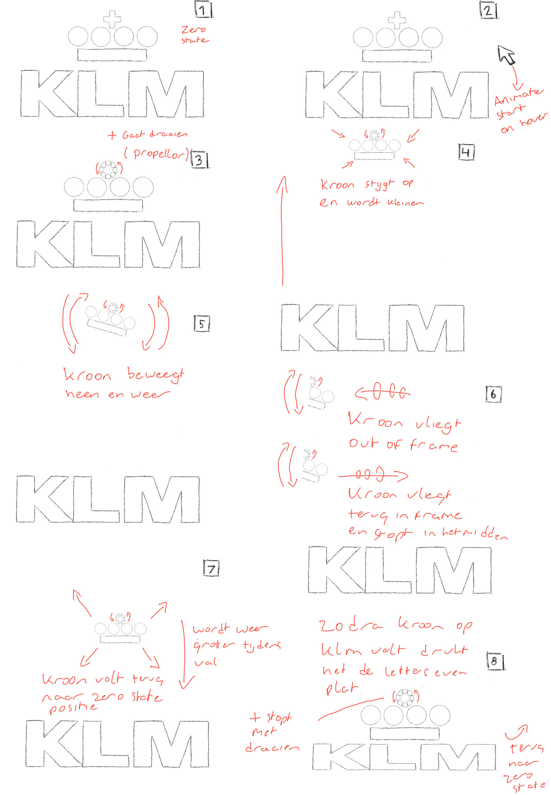
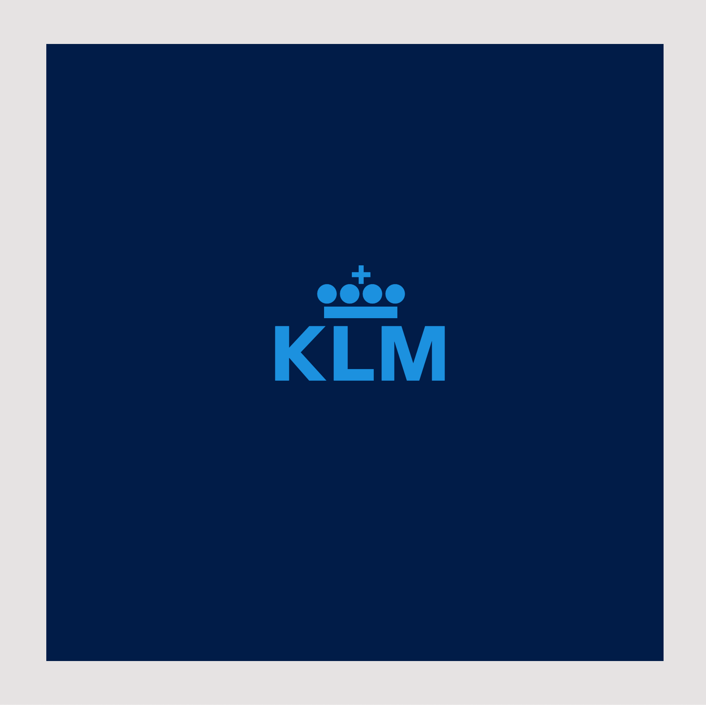
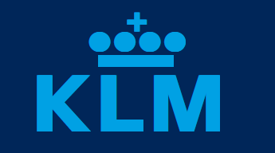
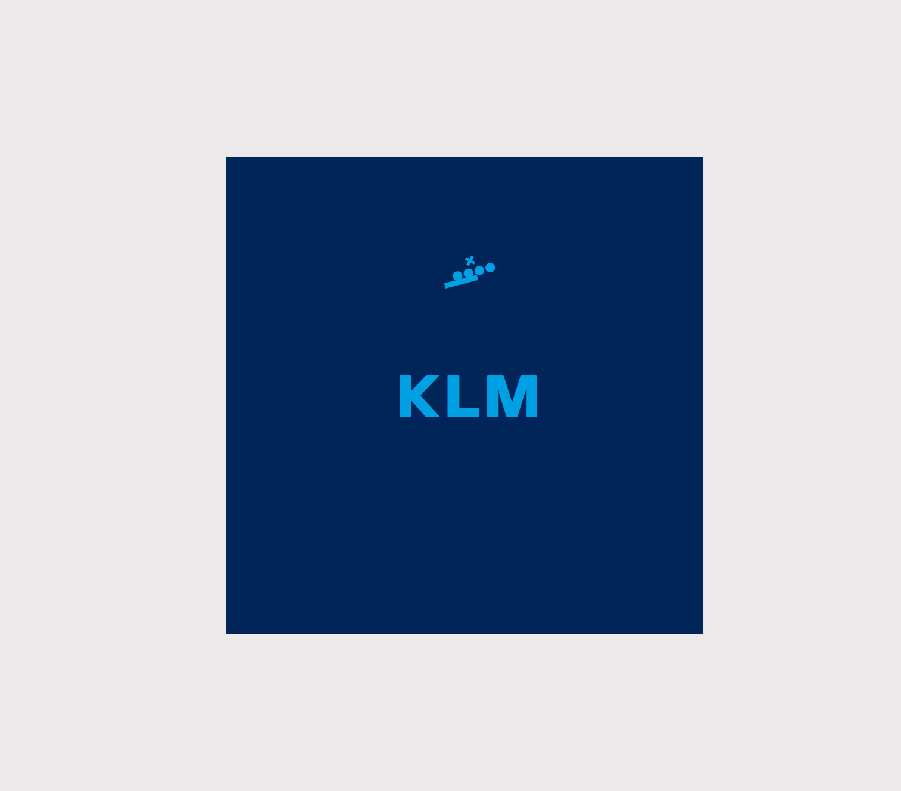

# Procesverslag
**Auteur:** -Jarno Voogd-

**De opdrachten:** [opdracht 1](opdracht1/index.html) en [opdracht 2](opdracht2/index.html)

Markdown is een simpele manier om HTML te schrijven.  
Markdown cheat cheet: [Hulp bij het schrijven van Markdown](https://github.com/adam-p/markdown-here/wiki/Markdown-Cheatsheet).

Nb. De standaardstructuur en de spartaanse opmaak van de README.md zijn helemaal prima. Het gaat om de inhoud van je procesverslag. Besteedt de tijd voor pracht en praal aan je website.

Nb. Door *open* toe te voegen aan een *details* element kun je deze standaard open zetten. Fijn om dat steeds voor de relevante stuk(ken) te doen.

## Bronnenlijst
  1. [Mozilla before/after](https://developer.mozilla.org/en-US/docs/Web/CSS/::before)
  2. [W3 Schools animations](https://www.w3schools.com/css/css3_animations.asp)
  2. [Css tricks before/after](https://css-tricks.com/almanac/selectors/a/after-and-before/)

  

## Opdracht 1 plan

  
uitwerken na schetsen idee (voor week 2)

  ### Je storyboard:
  

  ### Je ambitie: 
  Aan deze technieken/punten wil ik werken:
  - leren van keyframes
  - anineren zonder JS
  - mijn css slimmer schrijven
 

## Opdracht 1 reflectie

  
Opdracht 1. 
  Voor opdracht 1 heb ik een animatie gemaakt voor de Koninklijke Luchtvaart Maatschappij, KLM'. 
  De KLM is natuurlijk een luchtvaart maatschappij, en ze hebben dus te maken met vliegen. Mijn idee
  is om de kroon van het logo te laten vliegen.

  ### Je uitkomst - karakteristiek screenshot(s):
  

  ### Dit ging goed/Heb ik geleerd: 
  Wat ik heb geleerd, is het gebruik maken van een ::before en ::after atribute, hiermee heb ik de kroon van KLM gemaakt.
  Ik heb de kroon in drie delen opgedeeld; het balkje, de bolletjes en het kruisje. Deze drie onderdelen heb ik allemaal met 
  before en/of after gemaakt.

  Wat ik ook heb geleerd enkel met css animeren, keyframes gebruiken in mijn code
  en het gebruik van font-face voor fonts, deze drie dingen had ik nog niet eerder gedaan.

  

  ### Dit was lastig/Is niet gelukt:
  Ik had het einde van mijn animatie wat vloeiender willen laten verlopen. Omdat de kroon bestaat uit drie losse onderdelen
  bleek het lastig om rotaties mooi uit te laten voeren. 

  

## Opdracht 2 plan

  
Ik wil een pagina maken waarop de gebruiker een Nike schoen tot in detail kan customizen. Ik zal op de Nike
  website screenshots maken van elk onderdeel van de schoen in tien kleuren, dan knip ik al deze onderdelen uit in photoshop.
  Zodra ik dat gedaan heb kan ik deze gekleurde onderdelen over een plaatje van dezelfde blanco schoen plakken, op deze manier
  kan de gebruiker elk onderdeel apart van elkaar aanpassen. Daarnaast wil ik de gebruiker graag de mogelijkheid geven om
  zijn/haar creatie op te slaan (en dus ook terug te halen).

  ### Je ontwerp:
  

  ### Je ambitie: 
  Aan deze technieken/punten wil ik werken:
  - Schoen tot in detail kunnen customizen
  - Schoen kunnen opslaan
  - Opgeslagen schoen terug kunnen halen

## Opdracht 2 test

  
uitwerken na testen (week 7)

  - De pagina is nog niet responsive
  - Ik heb nog niet twee User Interface events gebruikt
  - De pagina heeft nog geen darkmode
  - De gebruiker kan maar één schoen opslaan
  - De gebruiker kan geen naam geven aan de creatie

  ### Bevinding 1:
  De pagina is nog niet volledig responsive van groot naar klein scherm.

  #### oplossing:
  Beschrijving hoe je het hebt hebt opgelost of als het niet gelukt is hoe je het zou oplossen (tekst en afbeeding(en)).

  ### Bevinding 2:
  Ik heb nog niet gebruik gemaakt van twee User Interface events.

  #### oplossing:
  Beschrijving hoe je het hebt hebt opgelost of als het niet gelukt is hoe je het zou oplossen (tekst en afbeeding(en)).

  ### Bevinding 3:
  De pagina heeft nog geen dark mode voor gebruikers die hier gebruik van willen maken.

  #### oplossing:
  Beschrijving hoe je het hebt hebt opgelost of als het niet gelukt is hoe je het zou oplossen (tekst en afbeeding(en)).

  ### Bevinding 4:
  De gebruiker kan maar één schoen opslaan en terughalen.

  #### oplossing:
  Beschrijving hoe je het hebt hebt opgelost of als het niet gelukt is hoe je het zou oplossen (tekst en afbeeding(en)).

  ### Bevinding 5:
  De gebruiker kan geen naam geven aan zijn/haar creatie.

  #### oplossing:
  Beschrijving hoe je het hebt hebt opgelost of als het niet gelukt is hoe je het zou oplossen (tekst en afbeeding(en)).

## Opdracht 2 reflectie

  
uitwerken bij afronden opdracht (voor week 8)

  ### Je uitkomst - karakteristiek screenshot(s):
  

  ### Dit ging goed/Heb ik geleerd: 
  Korte omschrijving met plaatje(s)

  

  ### Dit was lastig/Is niet gelukt:
  Korte omschrijving met plaatje(s)

  

